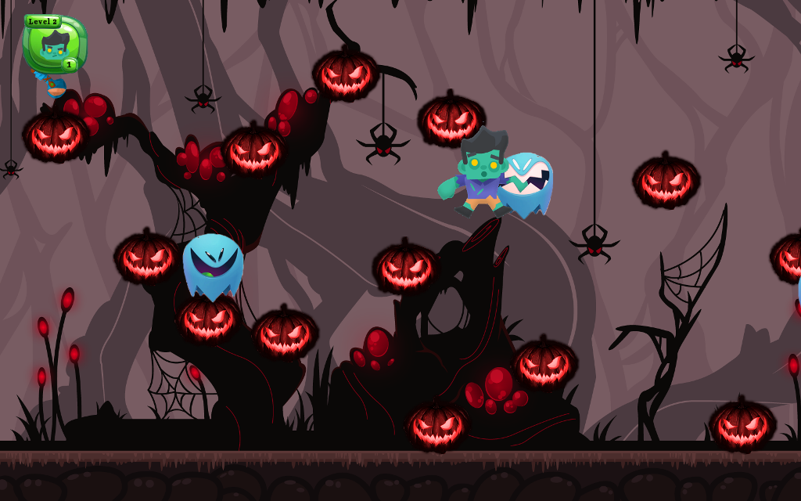

Simple implementation of 2d engine in C ++ programming language using SFML.

GameHalloween:

1. Single player game;
2. The game includes four levels;
3. Each level has enemies (ghosts) and moving pumpkins;
4. The player's goal is to jump on the pumpkins to reach the teleporter to the next level without dying from the enemy;
5. Player can kill enemies by jumping on top of them or hitting them from the side;
6. Player can increase his life by collecting jars.

Demonstration of game:

